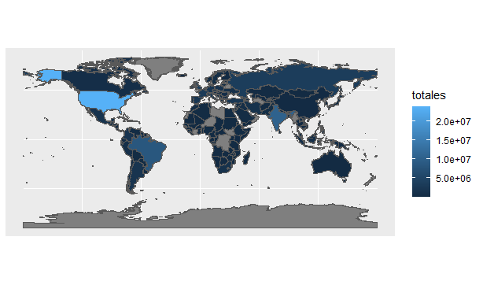
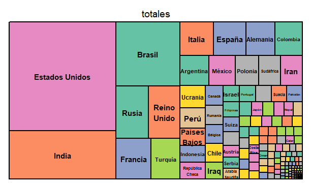
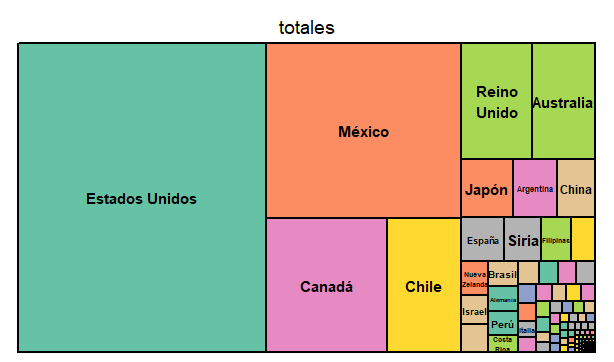
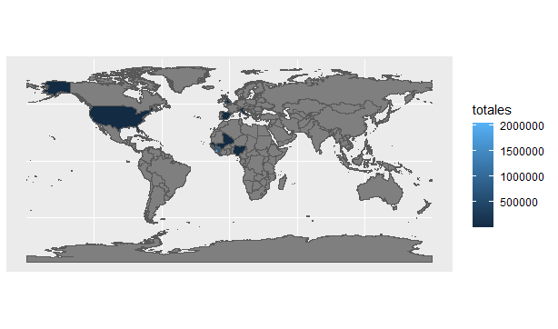
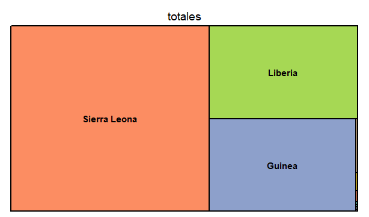
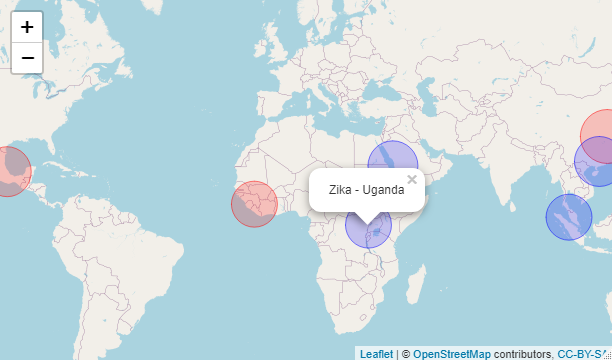

# Equipo 24 proyecto final

# Análisis de gravedad y letalidad de diversas pandemias a lo largo de la historia

_Conociendo la gravedad de la situación que vivimos en la actualidad, es de suma importancia analisar algunos detalles que han influenciado que esta pandemia y otras mas a lo largo de la historia han afectado a la humanidad y que relacion tienen entre ellas._


## Comenzando 🚀

_Puedes descargar el repositorio y consultar el codigo en lenguaje de programacipon R sobre el analisis realizado de las siguientes maneras:_

- Dando click en **Code** en el repositorio y despues **Download ZIP**.
- Haciendo un **Git clone** del repositorio directamente en tu computadora

### Pre-requisitos 📋

_Para poder observar en analisis, graficas y datos que se presentan en este proyecto, debes tener instalado el lñegunaje de programación R en tu ordenador, asi como cuañquier IDE que pueda soportar este lenguaje, te recomendamos "RStudio"_

_De igual forma debes se debe tener encuenta que se ocuparon data-sets de paginas como Kaggle, asi que es de suma iimportancia tener descargados estos data-sets para apreciar el analisis completo_

```
#Poner ruta propia
covid <- read.csv("C:/Users/end user/OneDrive/Escritorio/Santander-DataScience/Data/coronavirus.csv")
h1n1 <- read.csv("C:/Users/end user/OneDrive/Escritorio/Santander-DataScience/Data/H1N1.csv")
ebola <- read.csv("C:/Users/end user/OneDrive/Escritorio/Santander-DataScience/Data/ebola.csv")
```

### Instalación 🔧

_Para el desarrollo del codigo se utilizaron ciertas librerias de R que facitaron el analisis y la extraccion de datos_

_Las librerias son las siguientes:_

```
#Cargar las librerias
library(dplyr)
library(ggplot2)
library(tidyverse)
library(sf)
library(treemap)
library(leaflet)
```

_Hay librerias que RStudio ya tiene pre-instaladas pero algunas de ellas tu las debes instalar, por ejemplo:_

```
install.packages("data.table")
install.packages("rgdal")
install.packages("leaflet")
install.packages("treemap")
```

_Con todo lo anterior contemplado, se puede correr el codigo y observar el analisis del proyecto._

## Desarrollo y Análisis de 3 enfermedades que han afectado a la humanidad en los ultimos 20 años ⚙️

###  Análisis de la Pandemia Covid-19 ⚙️

_El principal enfoque del proyecto se basa en la comparacion de la actual pandemia Covid-19 respecto a otras graves enfermemdades, tanto en letalidad, alcance, afectaciones a la sociedad, entre muchos otros factores que se pueden analizar y asi poder entender su comportamiento, así como, el tiempo que tardo en propagarse a todo el mundo o la mayor parte de el y que paises fueron los mas afectos_

_El o la COVID-19 (acrónimo del inglés coronavirus disease 2019), covid-19 o covid, conocida en español como enfermedad por coronavirus 2019 e incorrectamente como neumonía por coronavirus, es una enfermedad infecciosa causada por el virus SARS-CoV-2._

_Produce síntomas similares a los de la gripe o catarro, entre los que se incluyen fiebre, tos,​ disnea, mialgia y fatiga. En casos graves se caracteriza por producir neumonía, síndrome de dificultad respiratoria aguda,15​ sepsis16​ y choque séptico que conduce a cerca de 3,75 % de los infectados a la muerte según la OMS.No existe tratamiento específico; las medidas terapéuticas principales consisten en aliviar los síntomas y mantener las funciones vitales._

_El primer análisis que podemos hacer sobre esta enfermedad es los casos totales que se tienen en todo el mundo, especificando estos datos en un mapa mundial para una mejor apreciación_



_Para observar de forma aun mas detallada y precisa para observar que paises son los que más casos de covid tienen, de realizo un Tree Map_



###  Análisis de la Pandemia Influenza H1N1 ⚙️

_El influenza virus A subtipo H1N1, más conocido como A H1N1 humana, es una especie de influenzavirus tipo A del virus de la gripe, perteneciente a la familia de los Orthomyxoviridae._

_El H1N1 ha mutado en diversos subtipos que incluyen la gripe española (la de mayor fatalidad en los humanos pero ya extinta en la vida silvestre), la gripe porcina, la gripe aviar y la gripe bovina. La cepa mantiene su circulación después de haber sido reintroducida por la población humana en los años 1970 (Gripe rusa de 1977)_

_Desde mediados de marzo de 2009, al menos 900 casos mortales han ocurrido en toda Europa y América por la pandemia de una cepa novedosa de H1N1, al menos otras 1000 muertes en México aún no están oficialmente confirmadas como casos de influenza H1N1, en el año 2013 y 2014 el gobierno de México dio la noticia de los nuevos casos de esta cepa del virus._

_El primer análisis que podemos hacer sobre esta enfermedad es los casos totales que se tienen en todo el mundo, especificando estos datos en un mapa mundial para una mejor apreciación_


_Para observar de forma aun mas detallada y precisa para observar que paises son los que más casos de covid tienen, de realizo un Tree Map_




###  Análisis de la Pandemia Ebola ⚙️

_El virus del Ébola1​ (Ebolavirus)​ es un género de virus de la familia Filoviridae que se detectó por primera vez en algunas regiones de África. La enfermedad que produce una fiebre hemorrágica viral de la misma categoría que la fiebre de Marburg, la fiebre de Lassa y la fiebre del dengue. Es el patógeno causante de la enfermedad del Ébola, una enfermedad infecciosa muy grave que afecta a los seres humanos._

_Este nombre proviene del río Ébola (en la República Democrática del Congo, antigua Zaire), donde fue identificado por primera vez en 1976 durante una epidemia con elevada tasa de mortalidad._

_El primer análisis que podemos hacer sobre esta enfermedad es los casos totales que se tienen en todo el mundo, especificando estos datos en un mapa mundial para una mejor apreciación_



_Para observar de forma aun mas detallada y precisa para observar que paises son los que más casos de covid tienen, de realizo un Tree Map_




## Comparación y Análisis de las 3 pandemias ⚙️

_Con toda la información obtenida anteriormente, se puede hacer un análisis mas profundo entre las tres pandemias y poder realizar una hipótesis sobre alguna posible causa o inclusive es muy facil determinar que los paises mayormente poblados son los que más afectaciones tienen en este tipo de pandemias, tal es el caso de México, esto depende de muchas otras cuestiones como la población o manejo de estas situaciones como paies particular, pero hablando en un ambito general, esto es un pequeño ejemplo de los análisis a los que podemos llegar con toda la información que se recopilo en este proyecto_

_Para iniciar, podemos determinar el origen de cada pandemia en los ultimos años, esto es, donde se registro el primer caso, tal como se muestra a continuación:_



_Para observarlo de una menera interactiva, da click [aquí](https://rpubs.com/Danielchon13/MapaOrigenes)_


## Autores ✒️

_Este proyecto fue realizado por el equipo 24 del programa Santander-DataScience, cuyos sintegrantes son:_

- **Oscar Cañongo** - \*\* - [OscarCanongo](https://github.com/OscarCanongo)
- **Andres** - \*\* - [andresam0301](https://github.com/andresam0301)
- **Daniel Arellano** - \*\* - [Tachuelin](https://github.com/Tachuelin)
